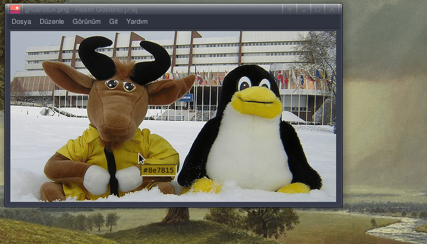

# tkpick
<a href="https://pypi.org/project/tkpick"></a>   

 A lighweigt screen color picker tool



### Availability
Only GNU/Linux 🐧

## Installing

Install via `pip` (No auto-update):

```
[sudo] pip install tkpick
```

## Usage

```sh
$ tkpick or Tkpick
```

or <kbd>Application Menu</kbd> > <kbd>Graphics</kbd> > <kbd>Tkpick</kbd>

## Shortcuts

Shortcut | Function
--- | ---
<kbd>Shift-c</kbd> | Copy color to clipboard
<kbd>Shift-a</kbd> | Open the about window
<kbd>Shift-q</kbd> | Close tool

## License
This project is licensed under the GPL-3.0 - see the [LICENSE](LICENSE) file for details.
